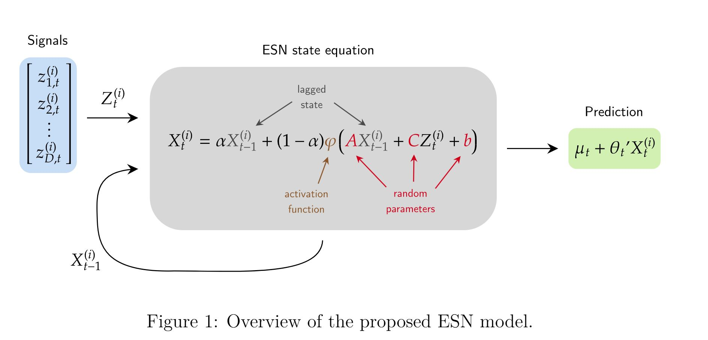
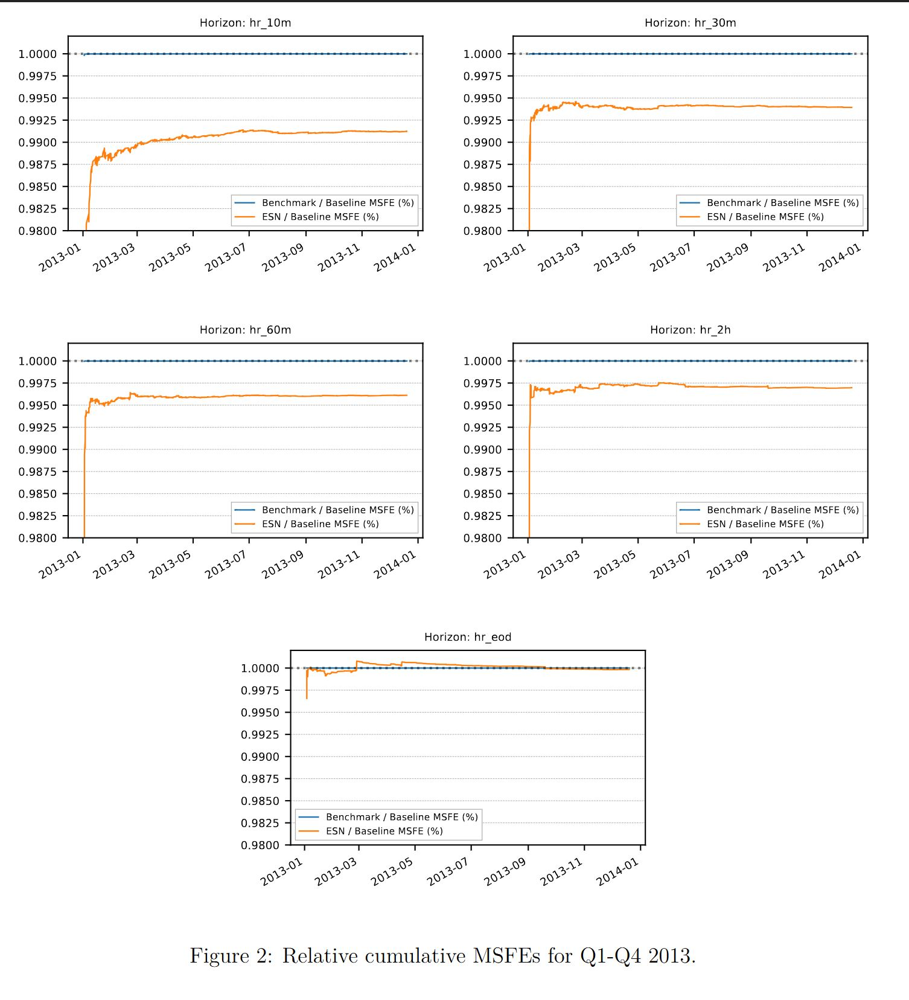
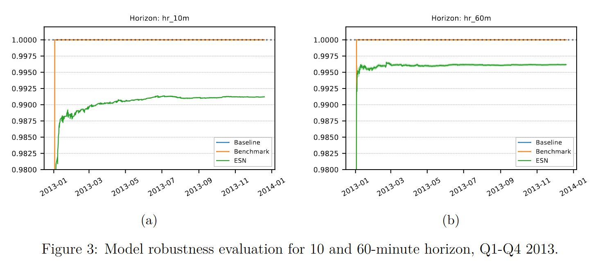

# Multi-Horizon Echo State Network Prediction of Intraday Stock Returns

**arXiv:** [2504.19623](https://arxiv.org/abs/2504.19623) (Computational Finance, Statistical Finance)

**DOI:** https://doi.org/10.48550/arXiv.2504.19623

**Keywords:** High-frequency data, reservoir computing, signal construction

---

## Abstract

> Stock return prediction is a problem that has received much attention in the finance literature. In recent years, sophisticated machine learning methods have been shown to perform significantly better than "classical" prediction techniques. One downside of these approaches is that they are often very expensive to implement, for both training and inference, because of their high complexity. We propose a return prediction framework for intraday returns at multiple horizons based on Echo State Network (ESN) models, wherein a large portion of parameters are drawn at random and never trained. We show that this approach enjoys the benefits of recurrent neural network expressivity, inherently efficient implementation, and strong forecasting performance.

This paper proposes using Echo State Network (ESN) models to predict intraday stock returns at multiple time horizons. ESN is a special class of recurrent neural networks (RNNs) whose majority of parameters are randomly initialized and then kept fixed — only the linear output layer needs to be trained. The authors demonstrate that this approach combines the expressiveness of RNNs, inherently efficient implementation, and strong forecasting performance.

---

## 1. Introduction

Time series prediction is of paramount importance in economics and finance. In financial portfolio management, forecasting stock characteristics (prices, returns, volatility, volume) is central to many trading strategies. While linear models have traditionally dominated, recent advances in machine learning have greatly expanded the available prediction methods.

In the systematic trading industry, multi-period portfolio construction approaches are increasingly common for solving optimal buy/sell decisions on financial assets (Meucci and Nicolosi, 2016), especially in medium-frequency trading settings where portfolio managers combine multiple signals, each with different predictive power profiles across time horizons (the systematic trading literature refers to this as having a different *alpha decay profile*).

This paper brings together two lines of research and proposes an efficient nonlinear method for predicting intraday returns at multiple time horizons. Specifically, we use **Echo State Networks (ESN)** (Jaeger, 2001; Lukoševičius and Jaeger, 2009), a special class of recurrent neural networks whose internal state parameters are randomly initialized and then kept fixed. With a linear output layer, ESN can be fitted via regularized linear regression — far simpler than deep neural network training procedures.

Three key advantages of ESN in this framework:
1. **Expressiveness**: ESN is a universal tool for approximating nonlinear time series models
2. **Multi-horizon adaptability**: The nonlinear state equation naturally supports multi-step prediction
3. **Computational efficiency**: Can solve high-dimensional data problems in short time

We consider two linear benchmark models: (1) linear regression based on signal vectors; (2) ridge-regularized linear model. The ESN approach first constructs recurrent state equations that nonlinearly combine historical signals, then uses a linear function to predict target returns.

In the empirical analysis, we forecast returns for 500 US stocks across 5 intraday time horizons (10min, 30min, 60min, 2hr, EOD). Results show that ESN outperforms benchmarks at all time horizons, achieving up to 0.87% MSFE reduction at the 10-minute horizon, and the results are highly robust to ESN random parameter sampling. The complete prediction pipeline runs in just a few minutes on one year of data.

---

## 2. Related Literature

Classical financial theory holds that raw stock returns are unpredictable given historical information. However, recent empirical research shows this is not entirely true at intraday frequencies. Aït-Sahalia et al. (2022) provide extensive evidence of predictability at the millisecond level. This paper operates in a milder setting (10-minute sampling) and still finds non-trivial predictability. (In terms of volatility forecasting, Dhaene and Wu (2020) show that intraday 5-minute resolution and overnight returns can also be incorporated in multivariate GARCH/BEKK-type models to sharpen prediction.)

### Machine Learning in Finance

- **Traditional NN**: Olson and Mossman (2003), Kwon and Moon (2007) use neural networks for stock prediction
- **DNN**: Yu and Yan (2020) use deep neural networks
- **LSTM**: Borovkova and Tsiamas (2019) use LSTM for high-frequency stock classification
- **RNN**: Tölö (2020) uses RNN to predict systemic financial crises
- **Bayesian NN**: Chandra and He (2021) on stock price prediction during COVID-19
- **GAN**: Wang and Chen (2024) propose factor-based GAN; Kim et al. (2024) use GAN for anomaly detection to enhance portfolio optimization; Vuletić et al. (2024) Fin-GAN outperforms LSTM and ARIMA on Sharpe ratio
- **Other ML applications**: Abedin et al. (2021) use deep learning for exchange rate prediction; Kim et al. (2023), Masi et al. (2023), Nagy et al. (2023), Acciaio et al. (2024), Kwon and Lee (2024) explore GAN/VAE synthetic financial data generation; Cetingoz and Lehalle (2025) offer a theoretical critique of this direction

### Random-Weight Neural Networks and Reservoir Computing

The use of random parameters in complex nonlinear models dates back to Lowe and Broomhead (1988) and Schmidt et al. (1992). Huang et al. (2006) proposed "extreme learning machines"; Rahimi and Recht (2008a,b) developed the "random kitchen sinks" method. The recent "lottery ticket" hypothesis (Frankle and Carbin, 2018; Malach et al., 2020; Ma et al., 2021; Sreenivasan et al., 2022) shows that small subnetworks within large NNs can achieve near full-network performance at initialization. Zhao et al. (2022) and Bolager et al. (2023) further design specialized sampling strategies. The computational cost of RC models can be orders of magnitude lower than full NN training (Lohn and Musser, 2022).

### Echo State Networks

ESN is a recently developed machine learning model designed to maintain the broad effectiveness of neural networks while reducing implementation complexity. ESN has been successfully applied to (Sun et al., 2024):
- Water level forecasting (Coulibaly, 2010)
- Electric load forecasting (Deihimi and Showkati, 2012)
- Renewable energy generation forecasting (Hu et al., 2020)
- Deep ESN architectures (Kim and King, 2020)
- Macroeconomic forecasting (Ballarin et al., 2024) — mixed-frequency ESN achieving SOTA on GDP prediction

Financial applications are less explored: Liu et al. (2018) study hyperparameter optimization on financial data; Trierweiler Ribeiro et al. (2021) use ESN to predict stock return volatility. Other randomization-based approaches include Akyildirim et al. (2023) with randomized signature methods and Gonon (2023) with theoretical guarantees.

---

## 3. Data and Setup

Intraday stock data is sourced from **AlgoSeek**, providing 1-minute resolution OHLC bars built from consolidated (SIP) trade data, covering all U.S. Exchanges and FINRA from January 2007 to October 2020. AlgoSeek bars cover the entire trading day:

- **Pre-market**: 4:00:00 AM – 9:29:59 AM (EST)
- **Market**: 9:30:00 AM – 4:00:00 PM (EST)
- **Extended hours**: 4:00:01 PM – 8:00:00 PM (EST)

Due to the large volume of 1-minute data, observations are downsampled to **10-minute resolution**.

### 3.1 Trading Setting

Simulating an intraday trading book with intraday-only rebalancing, no overnight positions. Portfolio rebalancing and return prediction occur every 10 minutes (9:30 AM to 3:50 PM). All predictions are for **overlapping returns**.

**5 prediction time horizons:**

| Horizon | Daily predictions | Description |
|---------|-------------------|-------------|
| 10 min  | 39                | 9:30 AM – 3:50 PM |
| 30 min  | 37                | |
| 60 min  | 34                | |
| 2 hr    | 28                | |
| EOD     | 39                | From current time to closing price |

At 3:50 PM, a closing auction order is submitted; at 4:00 PM, all positions are fully liquidated at the closing auction price.

### 3.2 Modeling Setup

Let the stock indices in the trading universe be $i = 1, \ldots, N$. For each stock, we have:
- Future return $r_{t+h}^{(i)}$
- $D$-dimensional signal vector $Z_t^{(i)} = (Z_{1,t}^{(i)}, \ldots, Z_{D,t}^{(i)})' \in \mathbb{R}^D$

The prediction target is the conditional expected return:

$$\mathbb{E}\left[r_{t+h}^{(i)} \mid \mathcal{F}_t^{(i)}\right], \quad \text{where} \quad \mathcal{F}_t^{(i)} := \sigma(Z_t^{(i)}, Z_{t-1}^{(i)}, \ldots)$$

It is assumed that all observable predictive information is fully embedded in the signals. For missing data, NaN is used, and the effective cross-sectional size is $N_t \leq N$.

### 3.3 Signal Construction

The primary goal of signal construction is to separate **stock-specific characteristics** from **general market structure**. Following Avellaneda and Lee (2010), continuous real-valued signals are constructed.

#### Step 1: Factor Decomposition

Assuming prices are governed by a continuous-time stochastic process, returns can be decomposed into drift, market factors (systematic), and idiosyncratic components:

$$\frac{dP_t^{(i)}}{P_t^{(i)}} = a^{(i)} dt + \sum_{j=1}^{J} b_j^{(i)} F_{j,t} + dU_t^{(i)}$$

Where:
- $a^{(i)}$: stock price drift
- $\{F_{j,t}\}_{j=1}^J$: returns of $J$ market risk factors
- $\{b_j^{(i)}\}_{j=1}^J$: factor loadings
- $dU_t^{(i)}$: stock-specific residual component

#### Step 2: OU Process Modeling

The residual term is modeled as an **Ornstein-Uhlenbeck process**:

$$dU_t^{(i)} = \kappa^{(i)} (m^{(i)} - U_t^{(i)}) dt + \sigma^{(i)} dW_t$$

Where $W_t$ is a standard Wiener process, and $\kappa^{(i)}$, $m^{(i)}$, $\sigma^{(i)}$ are stock-specific slowly-varying parameters.

#### Step 3: Discrete-Time Estimation

**PCA for factor extraction**: Principal Component Analysis is used to extract market factors from observed returns ($J = 15$), then regression:

$$r_t^{(i)} = a^{(i)} + \sum_{j=1}^{J} b_j^{(i)} F_{j,t} + \upsilon_t^{(i)}$$

yielding residuals $\{\hat{\upsilon}_t^{(i)}\}$.

**Discretized residuals**: For window size $P > 0$, define:

$$\hat{U}_{P,t}^{(i)} := \sum_{s=t-P}^{t} \hat{\upsilon}_s^{(i)}$$

**AR(1) regression for OU parameter estimation**:

$$\hat{U}_{P,t+1}^{(i)} = c_0^{(i)} + c_u^{(i)} \hat{U}_{P,t}^{(i)} + \eta_{P,t}^{(i)}$$

From which we obtain:
- $\kappa_P^{(i)} := -\log(c_u^{(i)})$
- $m_P^{(i)} := c_0^{(i)} / (1 - c_u^{(i)})$

#### Step 4: Z-score Signal

Define the z-score signal for window size $P$:

$$z_{P,t}^{(i)} := \frac{\hat{U}_{P,t}^{(i)} - m_P^{(i)}}{\sigma_P^{(i)}}, \quad \text{where} \quad \sigma_P^{(i)} := \sqrt{\frac{\text{Var}(\eta_{P,t}^{(i)})}{2\kappa_P^{(i)}}}$$

**Modified z-score** accounting for drift:

$$\tilde{z}_{P,t}^{(i)} := z_{P,t}^{(i)} - \frac{a^{(i)}}{\kappa_P^{(i)} \sigma_P^{(i)}}$$

#### Signal Configuration

- 15 market factors (explaining >90% of return variance). To handle missing price observations, return data is forward-filled, equivalent to the standard assumption that unobserved prices remain fixed at the last observation.
- **6 signals**, corresponding to different discretization windows: $P \in \{10, 20, 30, 60, 100, 150\}$
- Core signal uses $P = 10$; five alternative signals use $P \in \{20, 30, 60, 100, 150\}$

### 3.4 Linear Return Prediction

Linear benchmark model:

$$r_{t+h}^{(i)} = \mu_{t,h} + \beta_{t,h}' Z_t^{(i)} + \epsilon_{t+h}^{(i)}$$

Where $\mu_{t,h}$ is the market average return and $\beta_{t,h} \in \mathbb{R}^D$ is the feature coefficient vector (assumed constant across the cross-section). The linear prediction is $\hat{r}_{t+h}^{(i)} = \mu_{t,h} + \beta_{t,h}' Z_t^{(i)}$.

---

## 4. Echo State Networks

### 4.1 ESN Model Formulation

ESN is a class of recurrent neural networks whose internal parameters are randomly initialized and **kept fixed**. The core state equation:

$$X_t := \alpha X_{t-1} + (1 - \alpha) \varphi(A X_{t-1} + C Z_t + b)$$

Where:
- $X_t \in \mathbb{R}^K$: recurrent state (reservoir state)
- $Z_t \in \mathbb{R}^D$: input signal
- $A \in \mathbb{R}^{K \times K}$: random recurrence matrix
- $C \in \mathbb{R}^{K \times D}$: random input matrix
- $b \in \mathbb{R}^K$: random bias vector
- $\varphi$: element-wise nonlinear activation function (e.g., hyperbolic tangent or ReLU)
- $\alpha \in [0, 1]$: leak rate

**Output layer** (linear readout):

$$X_t \mapsto \mu_t + \theta_t' X_t$$

Where $\theta_t \in \mathbb{R}^K$ is the output coefficient vector and $\mu_t \in \mathbb{R}$ is the intercept.

**Remark 4.1 (Theoretical Justification):** Grigoryeva and Ortega (2018) and Gonon and Ortega (2020) have shown that ESNs are **universal approximators of time filters**: under general conditions, if $Y_t = H(Z_t, Z_{t-1}, \ldots)$ for some mapping $H$ from the infinite past history of $Z_t$ to $Y_t$, then an ESN can approximate $H$ arbitrarily well. Gonon et al. (2023) obtained explicit approximation bounds for this problem; Gonon et al. (2020) also constructed bounds on the generalization error when an ESN is trained and applied to new data. These results provide broad theoretical grounding for the choice of ESNs as nonlinear models for financial time series prediction.

#### Matrix Normalization

Randomly drawn matrices $A^*, C^*, b^*$ are normalized using hyperparameters:
- **Spectral radius** $\rho \in [0, 1]$: controls recurrence matrix dynamics
- **Input scaling** $\gamma > 0$: controls input influence
- **Bias scaling** $\zeta \geq 0$

The normalized matrices are $A := A^*/\|A^*\|_A$, $C := C^*/\|C^*\|_C$, $b := b^*/\|b^*\|_b$. The state equation then becomes:

$$X_t := \alpha X_{t-1} + (1 - \alpha) \varphi(\rho A X_{t-1} + \gamma C Z_t + \zeta b)$$

**Remark 4.2 (Random Matrix Sampling):** The entries of $A^*$ are drawn from a **sparse Gaussian distribution**, while the entries of $C^*$ are drawn from a **sparse uniform distribution**, since some empirical success with these has been observed in Ballarin et al. (2024). Moreover, in all ESN models, **$b$ is set to the zero vector** without any random draw. Accordingly, tuning of $\zeta$ is not discussed. The state equation actually used is:

$$X_t := \alpha X_{t-1} + (1 - \alpha) \varphi(\rho A X_{t-1} + \gamma C Z_t)$$

$\|\cdot\|_A$ is the largest absolute eigenvalue norm, so that the spectral radius of $A$ is unity.

> **Figure 1** (paper): Overview of the proposed ESN model — the signal vector is loaded into the ESN state equation and combined with the previous state via a nonlinear mapping with randomly-sampled parameters. The prediction equation is linear in the ESN states, allowing for (regularized) least squares estimation. The state parameters do not change when fitting the model; only $\mu_t$, $\theta_t$ are estimated.

### 4.2 Training and Estimation

The ESN training objective is to minimize the regularized empirical risk over a rolling window:

$$\mathcal{R}_{t,h}(\mu, \theta) := \frac{1}{M_t N} \sum_{s=t-\tau_h-M_t}^{t-\tau_h-1} \sum_{i=1}^{N} \left(r_{s+h}^{(i)} - \mu - \theta' X_s^{(i)}\right)^2 + \theta' \Lambda_{t,h} \theta$$

Where:
- $M_t$: training window size
- $\tau_h$: buffer zone, preventing information leakage in multi-period return prediction
- $\Lambda_{t,h}$: time-varying regularization matrix, selected via cross-validation

Since the objective is quadratic, optimization has a **closed-form solution** (ridge regression) — no iterative gradient descent is needed.

#### Baseline and Benchmark Linear Models

**Baseline** (no regularization, minimum window $M=1$):

$$\mathcal{R}_{t,h}^{lin}(\mu, \beta) := \frac{1}{N} \sum_{i=1}^{N} \left(r_{t-\tau_h-1+h}^{(i)} - \mu - \beta' Z_{t-\tau_h-1}^{(i)}\right)^2$$

**Benchmark** (same window and regularization as ESN):

$$\mathcal{R}_{t,h}^{reg\text{-}lin}(\mu, \beta) := \frac{1}{M_t N} \sum_{s=t-\tau_h-M_t}^{t-\tau_h-1} \sum_{i=1}^{N} \left(r_{s+h}^{(i)} - \mu - \beta' Z_s^{(i)}\right)^2 + \beta' \Lambda_{t,h} \beta$$

---

## 5. Forecasting Multi-horizon Returns

### ESN Model Configuration

State dimension is fixed at $K = 100$. Hyperparameters are optimized on September–December 2012 data using **Optuna** (Akiba et al., 2019) to minimize MSFE.

**Table 1: ESN Model Specifications**

| Hyperparameter | 10 min | 30 min | 1 hour | 2 hours | EOD |
|----------------|--------|--------|--------|---------|-----|
| $K$ (state dimension) | 100 | 100 | 100 | 100 | 100 |
| $\alpha$ (leak rate) | 0.9 | 0.2 | 0 | 0 | 0 |
| $A$ sparsity | 0.15 | 0.15 | 0.15 | 0.65 | 0.35 |
| $\rho$ (spectral radius) | 0.4 | 0.6 | 0.6 | 0.6 | 0 |
| $C$ sparsity | 0.95 | 0.55 | 0.75 | 0.85 | 0.25 |
| $\gamma$ (input scaling) | 0.005 | 0.005 | 0.005 | 0.005 | 0.015 |

Experiments use the full 12 months of 2013 data (~16,000 data points).

### 5.1 Results

#### MSFE Definition

Mean Squared Forecast Error at time $t$, horizon $h$, across $N_t$ stocks:

$$\text{MSFE}_{t,h} = \frac{1}{N_t} \sum_i \left(r_{t+h}^{(i)} - \hat{r}_{t+h}^{(i)}\right)^2$$

Cumulative MSFE:

$$\text{cuMSFE}_{t,h} = \frac{1}{t} \sum_s \text{MSFE}_{s,h}$$

#### Table 2: 2013 Q1–Q3 Cumulative MSFE

| Model | 10 min | 30 min | 1 hour | 2 hours | EOD |
|-------|--------|--------|--------|---------|-----|
| Baseline | 0.0557 | 0.1402 | 0.2331 | 0.3704 | 0.7088 |
| Benchmark | 0.0557 [-0.0010%] | 0.1402 [-0.0007%] | 0.2331 [-0.0004%] | 0.3704 [-0.0003%] | 0.7088 [-0.0001%] |
| **ESN** | **0.0552 [-0.8775%]** | **0.1393 [-0.6059%]** | **0.2322 [-0.3890%]** | **0.3693 [-0.3023%]** | **0.7087 [-0.0148%]** |

- ESN achieves the largest **0.87% MSFE reduction** at the 10-minute horizon
- Improvement decreases as the time horizon lengthens
- Even at EOD, ESN's improvement is still **two orders of magnitude** greater than simply adding regularization

#### Table 3: 2013 Q1–Q3 Prediction R²

| Model | 10 min | 30 min | 1 hour | 2 hours | EOD |
|-------|--------|--------|--------|---------|-----|
| Baseline | -0.0766 | -0.1213 | -0.1128 | -0.1656 | -0.1760 |
| Benchmark | -0.0766 | -0.1213 | -0.1127 | -0.1656 | -0.1760 |
| **ESN** | **-0.0675** | **-0.1146** | **-0.1084** | **-0.1621** | **-0.1758** |

All R² values are negative, but as Kelly et al. (2024) argue, negative R²'s are not a sign of poor predictive or strategy efficacy.

> **Figure 2** (paper): Relative cumulative MSFEs for Q1–Q4 2013 across all five horizons. The baseline linear specification provides the reference point. The difference between baseline and benchmark is essentially non-existent (negligible for practical purposes), while the ESN achieves consistent MSFE reduction. However, at the EOD horizon, the cumulative error at times grows above that of the linear models.

### Performance Testing

#### Table 4: Diebold-Mariano Test (Diebold and Mariano, 1995; Harvey et al., 1997)

| Comparison | 10 min | 30 min | 1 hour | 2 hours | EOD |
|------------|--------|--------|--------|---------|-----|
| ESN vs. Baseline (statistic) | 56.2202 | 53.2776 | 44.5731 | 30.6386 | 2.566 |
| p-value | [0] | [0] | [0] | [0] | [0.0103] |
| ESN vs. Benchmark (statistic) | 56.1913 | 53.2462 | 44.5448 | 30.6180 | 2.558 |
| p-value | [0] | [0] | [0] | [0] | [0.0105] |

The null hypothesis of equal predictive ability is extremely strongly rejected at all time horizons; only EOD has p-values slightly above 1%.

#### Table 5: Model Confidence Set (MCS) Test

Using $10^4$ bootstrap samples.

| Model | 10 min | 30 min | 1 hour | 2 hours | EOD |
|-------|--------|--------|--------|---------|-----|
| Baseline | ○ (p=0) | ○ (p=0) | ○ (p=0) | ○ (p=0) | ○ (p=0.0011) |
| Benchmark | ○ (p=0) | ○ (p=0) | ○ (p=0) | ○ (p=0) | ● (p=0.5766) |
| **ESN** | **● (p=1)** | **● (p=1)** | **● (p=1)** | **● (p=1)** | **● (p=1)** |

(● = included in the superior model set; ○ = excluded at the 5% level)

ESN **robustly dominates** the superior model set across all intraday time horizons. At EOD, both ESN and Benchmark are included.

### 5.2 Robustness to Parameter Sampling

The ESN's $A^*$ and $C^*$ matrices are resampled using 100 different random seeds (keeping Table 1 hyperparameters fixed), and evaluated at the 10-minute and 60-minute horizons.

Results show that ESN's predictive gains are **remarkably robust to random parameter sampling**.

> **Figure 3** (paper): Model robustness evaluation for 10-minute and 60-minute horizons over Q1–Q4 2013. Light and dark shaded bands show 90% and 50% frequency regions, respectively, for ESN models. Median ESN performance is shown as a solid line. The shaded interquantile ranges are very tight (hard to see), confirming that predictive performance is highly consistent across different random initializations.

---

## Appendix A: AlgoSeek OHLC Bar Schema

**Table 6: AlgoSeek OHLC bar table example**

| # | Field | Type | Description |
|---|-------|------|-------------|
| 1 | Date | YYYYMMDD | Trade Date |
| 2 | Ticker | String | Ticker Symbol |
| 3 | TimeBarStart | HHMM / HHMMSS / HHMMSSMMM | EST time-stamp |
| 4 | FirstTradePrice | Number | Price of first trade |
| 5 | HighTradePrice | Number | Price of highest trade |
| 6 | LowTradePrice | Number | Price of lowest trade |
| 7 | LastTradePrice | Number | Price of last trade |
| 8 | VolumeWeightPrice | Number | Trade volume weighted average price |
| 9 | Volume | Number | Total number of shares traded |
| 10 | TotalTrades | Number | Total number of trades |

## Appendix B: Signal Construction (PCA Details)

PCA is performed on the correlation matrix, yielding eigenvalues and corresponding eigenvectors $v_i^j$. The eigenportfolio and eigenportfolio returns for each index $j$ are:

$$Q_i^j = \frac{v_i^j}{\sigma^{(i)}}, \quad F_{jt} = \sum_{i=1}^{N} \frac{v_i^j}{\sigma^{(i)}} r_t^{(i)}, \quad j = 1, 2, \ldots, J$$

Where $\sigma^{(i)}$ is the standard deviation of stock $i$'s returns. The correlation matrix is constructed from pairwise covariances of standardized returns (z-scores).

## Appendix C: Model and Estimation Details

### Missing Data and State Decay

When input signals are missing, ESN uses **reservoir decay**: NaN values are replaced with zero vectors, and the state equation continues to iterate. For example, given signal sequence $\ldots, Z_{t-1}^{(i)}, \text{NaN}, Z_{t+1}^{(i)}, \ldots$, the state computation is:

- $X_{t-1}^{(i)} := \alpha X_{t-2}^{(i)} + (1-\alpha)\varphi(AX_{t-2}^{(i)} + CZ_{t-1}^{(i)})$ (normal)
- $X_t^{(i)} := \alpha X_{t-1}^{(i)} + (1-\alpha)\varphi(AX_{t-1}^{(i)})$ (missing — input is zero)
- $X_{t+1}^{(i)} := \alpha X_t^{(i)} + (1-\alpha)\varphi(AX_t^{(i)} + CZ_{t+1}^{(i)})$ (back to normal)

As long as $\alpha \in [0,1)$ and the spectral radius of $A$ is less than 1, the state contracts (decays) toward the zero vector. States during missing periods are **not included** in output coefficient estimation.

### Training Windows and Buffers

**Table 7: ESN training and cross-validation parameters**

| Training Parameter | 10 min | 30 min | 1 hour | 2 hours | EOD |
|-------------------|--------|--------|--------|---------|-----|
| $M_t$ (Window size) | 30 min | 30 min | 1 hour | 1 hour | 1 day |
| $\tau_h$ (Window buffer) | 10 min | 30 min | 1 hour | 2 hours | 1 day |
| CV frequency | 1 day | 1 day | 1 day | 1 day | 1 day |
| CV window size | 1 week | 1 week | 1 week | 1 week | 1 week |
| CV split ratio | 0.7 | 0.7 | 0.7 | 0.7 | 0.7 |

- **Window size**: Trade-off between window length and the negative impact of too much historical data on forecasting power
- **Window buffer**: $\tau_h \geq h$, chosen to be the minimum possible length for the given prediction horizon, preventing information leakage
- **Cross-validation**: Performed once per trading day, using the past week's data to select diagonal anisotropic ridge regularization matrix $\Lambda_{t,h}$
- **Split ratio**: 70% training / 30% validation, consistent across all horizons

### ESN Hyperparameter Optimization

The Python model optimization library **Optuna** (Akiba et al., 2019) is used to search for ESN hyperparameters at each time horizon in Table 1. The tuning sample includes only **September–December 2012** data. The same training and cross-validation parameters from Table 7 are used, with the objective of minimizing cumulative MSFE.

---

## 6. Conclusion

This paper proposes a novel approach using ESN models to predict intraday stock returns at multiple time horizons.

**Key findings:**
- The ESN approach is inherently nonparametric and can significantly improve forecasting performance across different time horizons
- The only exception is that EOD return improvement is relatively modest
- The DM test extremely strongly rejects the null of equal predictive ability at all time horizons (only EOD has p-values slightly above 1%); the MCS test shows ESN robustly dominates the superior model set at intraday horizons, with only EOD having both ESN and Benchmark included
- Despite ESN models inherently relying on randomly drawn parameters, prediction gains are robust to randomness at short- and medium-term intraday horizons
- Computational efficiency is extremely high: the complete prediction pipeline on one year of data runs in just a few minutes

**Future research directions:**
- This paper does not discuss model aggregation or ensembles; future work could design more sophisticated online model selection mechanisms, dynamically weighting multiple ESNs to improve prediction and profitability
- This paper restricts the ESN output layer to be linear; future work could evaluate whether more flexible output layers (e.g., shallow networks) can further improve performance

